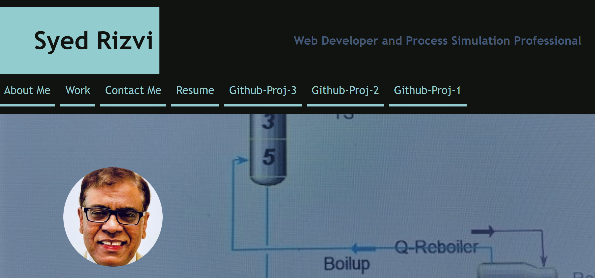
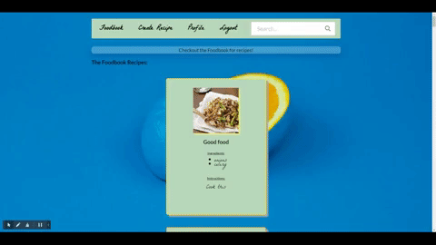
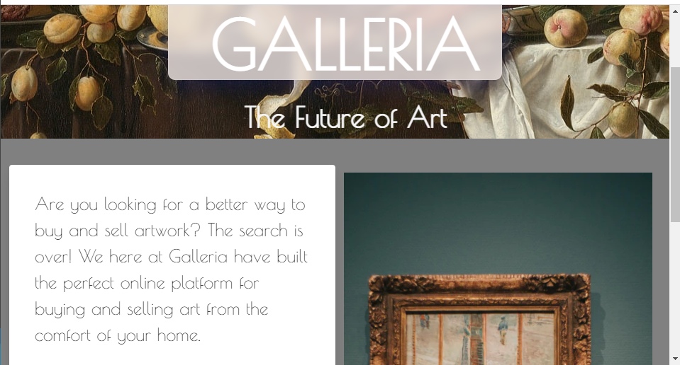
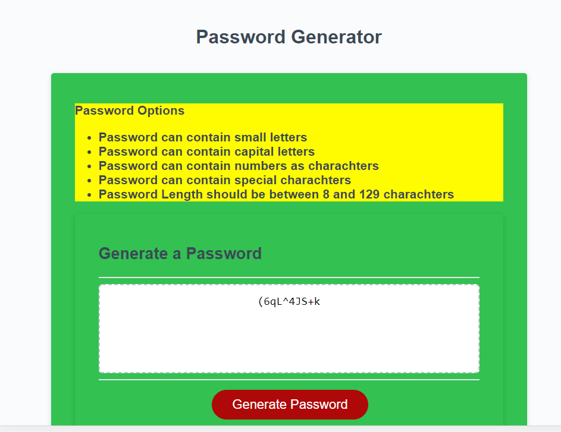
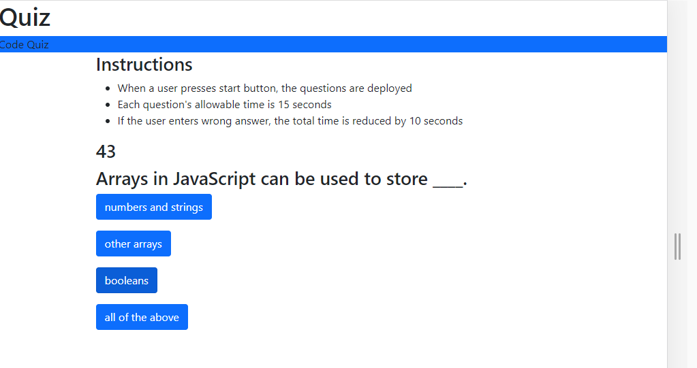

# Employer-Ready-Portfolio:
/img">  
# Project-3

This application allows users to view a collection (the Foodbook) of user-generated recipes, and create an account to add their own recipes to the Foodbook. This projct was completed using MERN stack. React provides the front-end and JavaScript library. MongoDB is the datbase to store recipes and user data.

Link to Github repository files: 

https://github.com/the64man1/foodbook

Link to Github pages website: 

https://foodbook-app.herokuapp.com/

 /img"> 
There were five contributors for this page; there names are as follow:

A. Max Quintanilla
B. Katherine Seeburger
C. Christian Louis
D. Syed S. Rizvi
E. Cristobal Canales

# Project-2

This app is to help promote the procurement and sales of high end paintings. The learning objective for five of us was to work in a full stack development enviornment to develop both front-end and back-end of this project.

Link to Github repository files: 

https://github.com/kthendavid04/gallery

Link to Github pages website: 
https://whispering-river-42546.herokuapp.com/

 /img"> 
There were five hardworking contributors for this page; there names are as follow:

A. Max Quintanilla
B. Katherine Seeburger
C. Luis Cuevas
D. Syed S. Rizvi
E. Cristobal Canales

# Project-1

This project uses Spoonacular and Edmam APIs to make a very practical web-page. The favorite recipies are searched and then saved with comments in the localStorage for future use.

Link to Github repository files: https://github.com/the64man1/Gooberville-Foods/

Link to Github pages website: https://the64man1.github.io/Gooberville-Foods/

/img"> 

Our Team

A. Max Quintanilla
B. Katherine Seeburger
C. Luis Cuevas
D. Syed S. Rizvi
E. Cristobal Canales

# Password Generator:

This random password generator is based on JavaScript and uses lower & upper case letters, numberes and special characters to generate a password between 8 to 15 characters long.

Link to Github Repo: https://github.com/rizvi5a/PasswordGen

Link to web page: https://rizvi5a.github.io/PasswordGen/

<!-- /img">   -->

# Code Quiz:

This quiz is based on testing user's basic JavaScript knowledge. The user is allowed to select correct answer within fifteen seconds from a menu of four multiple choice answers. 

Link to Github Repo: https://github.com/rizvi5a/Quiz

Link to web page: https://rizvi5a.github.io/Quiz

<!-- /img"> -->
